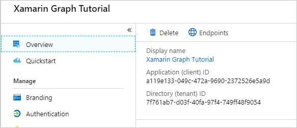

# 完了したプロジェクトを実行する方法

## 前提条件

このフォルダーで完了したプロジェクトを実行するには、次のものが必要です。

- 開発用コンピューターにインストールされている[Visual Studio](https://visualstudio.microsoft.com/vs/) 。 (**注:** このチュートリアルは、visual studio 2017 バージョン15.9.6 および visual Studio for Mac バージョン7.7.4 で記述されています。 このガイドの手順は、他のバージョンでは動作しますが、テストされていません。)
- Xamarin は、Visual Studio のインストールの一部としてインストールされます。 Xamarin のインストールと構成の手順については、「 [xamarin のインストール](https://docs.microsoft.com/xamarin/cross-platform/get-started/installation)」を参照してください。
- Outlook.com 上のメールボックスを持つ個人の Microsoft アカウント、または Microsoft 職場または学校のアカウントのいずれか。

Microsoft アカウントを持っていない場合は、無料のアカウントを取得するためのオプションがいくつかあります。

- [新しい個人用 Microsoft アカウントにサインアップ](https://signup.live.com/signup?wa=wsignin1.0&rpsnv=12&ct=1454618383&rver=6.4.6456.0&wp=MBI_SSL_SHARED&wreply=https://mail.live.com/default.aspx&id=64855&cbcxt=mai&bk=1454618383&uiflavor=web&uaid=b213a65b4fdc484382b6622b3ecaa547&mkt=E-US&lc=1033&lic=1)することができます。
- [Office 365 開発者プログラムにサインアップ](https://developer.microsoft.com/office/dev-program)して、無料の office 365 サブスクリプションを取得することができます。

## Azure Portal にアプリケーションを登録する

1. ブラウザーを開き、[Azure Active Directory 管理センター](https://aad.portal.azure.com)に移動します。 **個人用アカウント** (別名: Microsoft アカウント)、または**職場/学校アカウント**を使用してログインします。

1. **[新規登録]** を選択します。 **[アプリケーションを登録]** ページで、次のように値を設定します。

    - `Xamarin Graph Tutorial` に **[名前]** を設定します。
    - [**サポートされているアカウントの種類**] を [**任意の組織のディレクトリ内のアカウントと個人用の Microsoft アカウント**] に設定します。
    - **[リダイレクト URI]** を空のままにします。

    ![[アプリケーションの登録] ページのスクリーンショット](../../tutorial/images/aad-register-an-app.png)

1. [**登録**] を選択します。 **Xamarin Graph のチュートリアル**ページで、**アプリケーション (クライアント) ID**の値をコピーして保存します。次の手順で必要になります。

    

1. [**リダイレクト URI を追加する**] リンクを選択します。 [**リダイレクト uri** ] ページで、[**パブリッククライアント (モバイル、デスクトップ)] セクションの推奨されるリダイレクト uri**を見つけます。 で`msal`始まる uri**と**、 **urn: ietf: wg: oauth: 2.0: oob** uri を選択します。 で`msal`始まる値をコピーして、[**保存**] を選択します。 コピーしたリダイレクト URI を保存するには、次の手順で必要になります。

    

## サンプルを構成する

1. ファイルの`./GraphTutorial/GraphTutorial/Models/OAuthSettings.cs.example`名前を`OAuthSettings.cs`に変更します。
1. `OAuthSettings.cs`ファイルを編集し、次のように変更します。
    1. を`YOUR_APP_ID_HERE` Azure ポータルから取得した**アプリケーション Id**に置き換えます。
1. **Graphtutorial**のプロジェクトで、 `Info.plist`ファイルを開きます。
    1. [**詳細設定**] タブで、[ **URL の種類**] セクションを探します。 [ **URL スキーマ**] の値を`YOUR_APP_ID_HERE` 、Azure portal から取得した**アプリケーション Id**に置き換えます。
1. **Graphtutorial. Android**プロジェクトで、 `Properties/AndroidManifest.xml`ファイルを開きます。
    1. を`YOUR_APP_ID_HERE` Azure ポータルから取得した**アプリケーション Id**に置き換えます。

## サンプルを実行する

Visual Studio で、 **F5**キーを押すか、デバッグ > 選択して**デバッグを開始**します。
