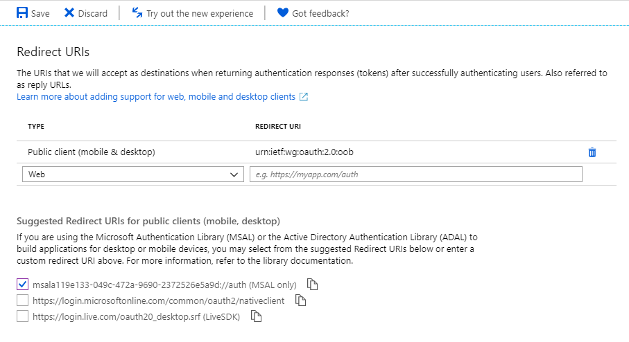

# 完了したプロジェクトを実行する方法How to run the completed project

## 前提条件Prerequisites

このフォルダーで完了したプロジェクトを実行するには、次のものが必要です。To run the completed project in this folder, you need the following:

- 開発用コンピューターにインストールされている[Visual Studio](https://visualstudio.microsoft.com/vs/) 。[Visual Studio](https://visualstudio.microsoft.com/vs/) installed on your development machine. (**注:** このチュートリアルは、visual studio 2017 バージョン15.9.6 および visual Studio for Mac バージョン7.7.4 で記述されています。(**Note:** This tutorial was written with Visual Studio 2017 version 15.9.6 and Visual Studio for Mac version 7.7.4. このガイドの手順は、他のバージョンでは動作しますが、テストされていません。)The steps in this guide may work with other versions, but that has not been tested.)
- Xamarin は、Visual Studio のインストールの一部としてインストールされます。Xamarin installed as part of your Visual Studio installation. Xamarin のインストールと構成の手順については、「 [xamarin のインストール](https://docs.microsoft.com/xamarin/cross-platform/get-started/installation)」を参照してください。See [Installing Xamarin](https://docs.microsoft.com/xamarin/cross-platform/get-started/installation) for instructions on installing and configuring Xamarin.
- Outlook.com 上のメールボックスを持つ個人の Microsoft アカウント、または Microsoft 職場または学校のアカウントのいずれか。Either a personal Microsoft account with a mailbox on Outlook.com, or a Microsoft work or school account.

Microsoft アカウントを持っていない場合は、無料のアカウントを取得するためのオプションがいくつかあります。If you don't have a Microsoft account, there are a couple of options to get a free account:

- [新しい個人用 Microsoft アカウントにサインアップ](https://signup.live.com/signup?wa=wsignin1.0&rpsnv=12&ct=1454618383&rver=6.4.6456.0&wp=MBI_SSL_SHARED&wreply=https://mail.live.com/default.aspx&id=64855&cbcxt=mai&bk=1454618383&uiflavor=web&uaid=b213a65b4fdc484382b6622b3ecaa547&mkt=E-US&lc=1033&lic=1)することができます。You can [sign up for a new personal Microsoft account](https://signup.live.com/signup?wa=wsignin1.0&rpsnv=12&ct=1454618383&rver=6.4.6456.0&wp=MBI_SSL_SHARED&wreply=https://mail.live.com/default.aspx&id=64855&cbcxt=mai&bk=1454618383&uiflavor=web&uaid=b213a65b4fdc484382b6622b3ecaa547&mkt=E-US&lc=1033&lic=1).
- [Office 365 開発者プログラムにサインアップ](https://developer.microsoft.com/office/dev-program)して、無料の office 365 サブスクリプションを取得することができます。You can [sign up for the Office 365 Developer Program](https://developer.microsoft.com/office/dev-program) to get a free Office 365 subscription.

## Azure Portal にアプリケーションを登録するRegister an application with the Azure Portal

1. ブラウザーを開き、[Azure Active Directory 管理センター](https://aad.portal.azure.com)に移動します。Open a browser and navigate to the [Azure Active Directory admin center](https://aad.portal.azure.com). **個人用アカウント** (別名: Microsoft アカウント)、または**職場/学校アカウント**を使用してログインします。Login using a **personal account** (aka: Microsoft Account) or **Work or School Account**.

1. **[新規登録]** を選択します。Select **New registration**. **[アプリケーションを登録]** ページで、次のように値を設定します。On the **Register an application** page, set the values as follows.

    - `Xamarin Graph Tutorial` に **[名前]** を設定します。Set **Name** to `Xamarin Graph Tutorial`.
    - [**サポートされているアカウントの種類**] を [**任意の組織のディレクトリ内のアカウントと個人用の Microsoft アカウント**] に設定します。Set **Supported account types** to **Accounts in any organizational directory and personal Microsoft accounts**.
    - **[リダイレクト URI]** を空のままにします。Leave **Redirect URI** empty.

    ![[アプリケーションの登録] ページのスクリーンショット](../../tutorial/images/aad-register-an-app.png)

1. [**登録**] を選択します。Choose **Register**. **Xamarin Graph のチュートリアル**ページで、**アプリケーション (クライアント) ID**の値をコピーして保存します。次の手順で必要になります。On the **Xamarin Graph Tutorial** page, copy the value of the **Application (client) ID** and save it, you will need it in the next step.

    

1. [**リダイレクト URI を追加する**] リンクを選択します。Select the **Add a Redirect URI** link. [**リダイレクト uri** ] ページで、[**パブリッククライアント (モバイル、デスクトップ)] セクションの推奨されるリダイレクト uri**を見つけます。On the **Redirect URIs** page, locate the **Suggested Redirect URIs for public clients (mobile, desktop)** section. で`msal`始まる uri**と**、 **urn: ietf: wg: oauth: 2.0: oob** uri を選択します。Select the URI that begins with `msal` **and** the **urn:ietf:wg:oauth:2.0:oob** URI. で`msal`始まる値をコピーして、[**保存**] を選択します。Copy the value that begins with `msal`, then choose **Save**. コピーしたリダイレクト URI を保存するには、次の手順で必要になります。Save the copied redirect URI, you will need it in the next step.

    

## サンプルを構成するConfigure the sample

1. ファイルの`./GraphTutorial/GraphTutorial/Models/OAuthSettings.cs.example`名前を`OAuthSettings.cs`に変更します。Rename the `./GraphTutorial/GraphTutorial/Models/OAuthSettings.cs.example` file to `OAuthSettings.cs`.
1. `OAuthSettings.cs`ファイルを編集し、次のように変更します。Edit the `OAuthSettings.cs` file and make the following changes.
    1. を`YOUR_APP_ID_HERE` Azure ポータルから取得した**アプリケーション Id**に置き換えます。Replace `YOUR_APP_ID_HERE` with the **Application Id** you got from the Azure portal.
1. **Graphtutorial**のプロジェクトで、 `Info.plist`ファイルを開きます。In the **GraphTutorial.iOS** project, open the `Info.plist` file.
    1. [**詳細設定**] タブで、[ **URL の種類**] セクションを探します。On the **Advanced** tab, locate the **URL Types** section. [ **URL スキーマ**] の値を`YOUR_APP_ID_HERE` 、Azure portal から取得した**アプリケーション Id**に置き換えます。In the **URL Schemes** value, replace `YOUR_APP_ID_HERE` with the **Application Id** you got from the Azure portal.
1. **Graphtutorial. Android**プロジェクトで、 `Properties/AndroidManifest.xml`ファイルを開きます。In the **GraphTutorial.Android** project, open the `Properties/AndroidManifest.xml` file.
    1. を`YOUR_APP_ID_HERE` Azure ポータルから取得した**アプリケーション Id**に置き換えます。Replace `YOUR_APP_ID_HERE` with the **Application Id** you got from the Azure portal.

## サンプルを実行するRun the sample

Visual Studio で、 **F5**キーを押すか、デバッグ > 選択して**デバッグを開始**します。In Visual Studio, press **F5** or choose **Debug > Start Debugging**.
