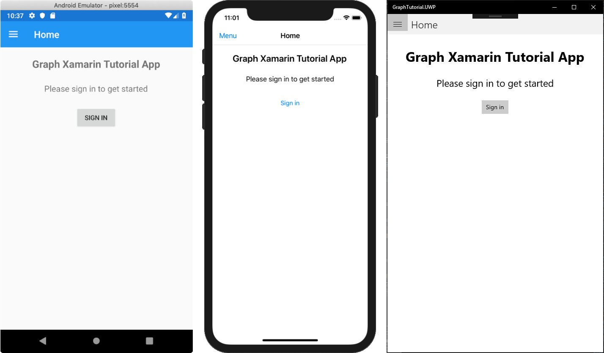

<!-- markdownlint-disable MD002 MD041 -->

Visual Studio を開き、[ **File > New > Project**] を選択します。 [**新しいプロジェクト**] ダイアログボックスで、次の操作を行います。

1. [ **Visual C# > クロスプラットフォーム**] を選択します。
1. [**モバイルアプリ] (Xamarin)** を選択します。
1. プロジェクトの名前として「 **graphtutorial** 」と入力します。

![Visual Studio 2017 [新しいプロジェクトの作成] ダイアログ](images/new-project-dialog.png)

> [!IMPORTANT]
> これらのラボ手順で指定した Visual Studio プロジェクトに対して、まったく同じ名前を入力してください。 Visual Studio プロジェクト名は、コード内の名前空間の一部になります。 これらの手順内のコードは、この手順で指定した Visual Studio プロジェクト名に一致する名前空間によって決まります。 別のプロジェクト名を使用すると、プロジェクトの作成時に入力した Visual Studio プロジェクト名と一致するようにすべての名前空間を調整しない限り、コードはコンパイルされません。

**[OK]** を選択します。 [**クロスプラットフォームアプリの新規作成**] ダイアログで **、空**のテンプレートを選択し、**コード共有戦略**の選択が **.net Standard**であることを確認します。 特定のプラットフォームをスキップすることを計画している場合は、[**プラットフォーム**] の下で選択を解除できます。 [ **OK]** を選択してソリューションを作成します。

![Visual Studio 2017 の [クロスプラットフォームアプリの新規作成] ダイアログ](images/new-cross-platform-app-dialog.png)

に進む前に、後で使用する追加の NuGet パッケージをインストールします。

- Azure AD 認証とトークン管理を処理するための[クライアント](https://www.nuget.org/packages/Microsoft.Identity.Client/)。
- microsoft graph に電話をかけるための[グラフ](https://www.nuget.org/packages/Microsoft.Graph/)です。

[**ツール > NuGet パッケージマネージャー > パッケージマネージャーコンソール**] を選択します。 パッケージマネージャーコンソールで、次のコマンドを入力します。

```Powershell
Install-Package Microsoft.Identity.Client -Version 2.7.0 -Project GraphTutorial
Install-Package Xamarin.Android.Support.Compat -Version 27.0.2.1 -Project GraphTutorial.Android
Install-Package Microsoft.Identity.Client -Version 2.7.0 -Project GraphTutorial.Android
Install-Package Microsoft.Identity.Client -Version 2.7.0 -Project GraphTutorial.iOS
Install-Package Microsoft.Graph -Version 1.12.0 -Project GraphTutorial
```

## <a name="design-the-app"></a>アプリを設計する

最初に、認証`App`の状態とサインインしているユーザーを追跡するための変数を追加するクラスを更新します。 **ソリューションエクスプローラー**で、 **graphtutorial**プロジェクトを展開し、app.xaml ファイル**** を展開します。 **App.xaml.cs**ファイルを開き、次`using`のステートメントをファイルの先頭に追加します。

```cs
using System.ComponentModel;
using System.IO;
using System.Reflection;
using System.Threading.Tasks;
```

次に、クラス`INotifyPropertyChanged`宣言にインターフェイスを追加します。

```cs
public partial class App : Application, INotifyPropertyChanged
```

ここで、次のプロパティを`App`クラスに追加します。

```cs
// Is a user signed in?
private bool isSignedIn;
public bool IsSignedIn
{
    get { return isSignedIn; }
    set
    {
        isSignedIn = value;
        OnPropertyChanged("IsSignedIn");
        OnPropertyChanged("IsSignedOut");
    }
}

public bool IsSignedOut { get { return !isSignedIn; } }

// The user's display name
private string userName;
public string UserName
{
    get { return userName; }
    set
    {
        userName = value;
        OnPropertyChanged("UserName");
    }
}

// The user's email address
private string userEmail;
public string UserEmail
{
    get { return userEmail; }
    set
    {
        userEmail = value;
        OnPropertyChanged("UserEmail");
    }
}

// The user's profile photo
private ImageSource userPhoto;
public ImageSource UserPhoto
{
    get { return userPhoto; }
    set
    {
        userPhoto = value;
        OnPropertyChanged("UserPhoto");
    }
}
```

ここで、次の関数を`App`クラスに追加します。 、、および`GetUserInfo`関数は、現時点では単なるプレースホルダーです。 `SignIn` `SignOut`

```cs
public async Task SignIn()
{
    await GetUserInfo();

    IsSignedIn = true;
}

public async Task SignOut()
{
    UserPhoto = null;
    UserName = string.Empty;
    UserEmail = string.Empty;
    IsSignedIn = false;
}

private async Task GetUserInfo()
{
    UserPhoto = ImageSource.FromStream(() => GetUserPhoto());
    UserName = "Adele Vance";
    UserEmail = "adelev@contoso.com";
}

private Stream GetUserPhoto()
{
    // Return the default photo
    return Assembly.GetExecutingAssembly().GetManifestResourceStream("GraphTutorial.no-profile-pic.png");
}
```

関数`GetUserPhoto`は、現在の既定の写真を返します。 ここでファイルを指定するか、または[GitHub](https://github.com/microsoftgraph/msgraph-training-xamarin/blob/master/tutorial/images/no-profile-pic.png)からサンプルで使用されているファイルをダウンロードすることができます。 ファイルを`./GraphTutorial/GraphTutorial`ディレクトリにコピーします。 **ソリューションエクスプローラー**で**graphtutorial**プロジェクトを右クリックして、[**追加**]、[**既存の項目.**..] の順に選択します。ファイルを`no-profile-pic.png`選択し、[**追加**] を選択します。 次に、**ソリューションエクスプローラー**でファイルを右クリックし、[**プロパティ**] を選択します。 [**プロパティ**] ウィンドウで、[**ビルドアクション**] の値を [**埋め込ま**れたリソース] に変更します。

![PNG ファイルの [プロパティ] ウィンドウのスクリーンショット](./images/png-file-properties.png)

### <a name="app-navigation"></a>アプリナビゲーション

次に、アプリケーションのメインページを[マスター/詳細ページ](/xamarin/xamarin-forms/app-fundamentals/navigation/master-detail-page)に変更します。 これにより、アプリの表示を切り替えるナビゲーションメニューが提供されます。

**graphtutorial**プロジェクトで**MainPage**ファイルを開き、その内容を次のように置き換えます。

```xml
<?xml version="1.0" encoding="utf-8" ?>
<MasterDetailPage xmlns="http://xamarin.com/schemas/2014/forms"
             xmlns:x="http://schemas.microsoft.com/winfx/2009/xaml"
             xmlns:local="clr-namespace:GraphTutorial"
             x:Class="GraphTutorial.MainPage">

    <MasterDetailPage.Master>
        <local:MenuPage/>
    </MasterDetailPage.Master>

    <MasterDetailPage.Detail>
        <NavigationPage>
            <x:Arguments>
                <local:WelcomePage/>
            </x:Arguments>
        </NavigationPage>
    </MasterDetailPage.Detail>

</MasterDetailPage>
```

#### <a name="implement-the-menu"></a>メニューを実装する

最初に、メニュー項目を表すためのモデルを作成します。 **graphtutorial**プロジェクトを右クリックし、[**追加**]、[**新しいフォルダー**] の順に選択します。 フォルダー `Models`に名前を指定します。

[**モデル**] フォルダーを右クリックし、[**追加**]、[**クラス.**..] の順に選択します。クラス`NavMenuItem`の名前を指定して、[**追加**] を選択します。 **NavMenuItem.cs**ファイルを開き、その内容を次のように置き換えます。

```cs
namespace GraphTutorial.Models
{
    public enum MenuItemType
    {
        Welcome,
        Calendar
    }

    public class NavMenuItem
    {
        public MenuItemType Id { get; set; }

        public string Title { get; set; }
    }
}
```

次に、メニューページを追加します。 **graphtutorial**プロジェクトを右クリックし、[**追加**]、[**新しいアイテム**] の順に選択します。[**コンテンツ] ページ**を選択し`MenuPage`、ページに名前を指定します。 **[追加]** を選択します。 **MenuPage**ファイルを開き、その内容を次のように置き換えます。

```xml
<?xml version="1.0" encoding="utf-8" ?>
<ContentPage xmlns="http://xamarin.com/schemas/2014/forms"
             xmlns:x="http://schemas.microsoft.com/winfx/2009/xaml"
             xmlns:ios="clr-namespace:Xamarin.Forms.PlatformConfiguration.iOSSpecific;assembly=Xamarin.Forms.Core"
             ios:Page.UseSafeArea="true"
             Title="Menu"
             x:Class="GraphTutorial.MenuPage">
    <ContentPage.Padding>
        <OnPlatform x:TypeArguments="Thickness">
            <On Platform="UWP" Value="10, 10, 10, 10" />
        </OnPlatform>
    </ContentPage.Padding>
    <ContentPage.Content>
        <StackLayout VerticalOptions="Start" HorizontalOptions="Center">
            <StackLayout x:Name="UserArea" />

            <!-- Signed out UI -->
            <StackLayout IsVisible="{Binding Path=IsSignedOut, Source={x:Static Application.Current}}">
                <Label Text="Sign in to get started"
                       HorizontalOptions="Center"
                       FontAttributes="Bold"
                       FontSize="Medium"
                       Margin="10,20,10,20" />
                <Button Text="Sign in"
                        Clicked="OnSignIn"
                        HorizontalOptions="Center" />
            </StackLayout>

            <!-- Signed in UI -->
            <StackLayout IsVisible="{Binding Path=IsSignedIn, Source={x:Static Application.Current}}">
                <Image Source="{Binding Path=UserPhoto, Source={x:Static Application.Current}}"
                       HorizontalOptions="Center"
                       Margin="0,20,0,10" />
                <Label Text="{Binding Path=UserName, Source={x:Static Application.Current}}"
                       HorizontalOptions="Center"
                       FontAttributes="Bold"
                       FontSize="Small" />
                <Label Text="{Binding Path=UserEmail, Source={x:Static Application.Current}}"
                       HorizontalOptions="Center"
                       FontAttributes="Italic" />
                <Button Text="Sign out"
                        Margin="0,20,0,20"
                        Clicked="OnSignOut"
                        HorizontalOptions="Center" />
                <ListView x:Name="ListViewMenu"
                          HasUnevenRows="True"
                          HorizontalOptions="Start">
                    <ListView.ItemTemplate>
                        <DataTemplate>
                            <ViewCell>
                                <Grid Padding="10">
                                    <Label Text="{Binding Title}" FontSize="20"/>
                                </Grid>
                            </ViewCell>
                        </DataTemplate>
                    </ListView.ItemTemplate>
                </ListView>
            </StackLayout>
        </StackLayout>
    </ContentPage.Content>
</ContentPage>
```

次に、**ソリューションエクスプローラー**で**MenuPage**を展開し、 **MenuPage.xaml.cs**ファイルを開きます。 その内容を次のように置き換えます。

```cs
using System;
using System.Collections.Generic;
using System.Linq;
using System.Text;
using System.Threading.Tasks;

using Xamarin.Forms;
using Xamarin.Forms.Xaml;

using GraphTutorial.Models;

namespace GraphTutorial
{
    [XamlCompilation(XamlCompilationOptions.Compile)]
    public partial class MenuPage : ContentPage
    {
        MainPage RootPage { get => Application.Current.MainPage as MainPage; }
        List<NavMenuItem> menuItems;

        public MenuPage ()
        {
            InitializeComponent ();

            // Add items to the menu
            menuItems = new List<NavMenuItem>
            {
                new NavMenuItem {Id = MenuItemType.Welcome, Title="Home" },
                new NavMenuItem {Id = MenuItemType.Calendar, Title="Calendar" }
            };
            ListViewMenu.ItemsSource = menuItems;

            // Initialize the selected item
            ListViewMenu.SelectedItem = menuItems[0];

            // Handle the ItemSelected event to navigate to the
            // selected page
            ListViewMenu.ItemSelected += async (sender, e) =>
            {
                if (e.SelectedItem == null)
                    return;

                var id = (int)((NavMenuItem)e.SelectedItem).Id;
                await RootPage.NavigateFromMenu(id);
            };
        }

        private async void OnSignOut(object sender, EventArgs e)
        {
            var signout = await DisplayAlert("Sign out?", "Do you want to sign out?", "Yes", "No");
            if (signout)
            {
                await (Application.Current as App).SignOut();
            }
        }

        private async void OnSignIn(object sender, EventArgs e)
        {
            await (Application.Current as App).SignIn();
        }
    }
}
```

#### <a name="implement-the-welcome-page"></a>ウェルカムページを実装する

**graphtutorial**プロジェクトを右クリックし、[**追加**]、[**新しいアイテム**] の順に選択します。[**コンテンツ] ページ**を選択し`WelcomePage`、ページに名前を指定します。 **[追加]** を選択します。 **WelcomePage**ファイルを開き、その内容を次のように置き換えます。

```xml
<?xml version="1.0" encoding="utf-8" ?>
<ContentPage xmlns="http://xamarin.com/schemas/2014/forms"
             xmlns:x="http://schemas.microsoft.com/winfx/2009/xaml"
             Title="Home"
             x:Class="GraphTutorial.WelcomePage">
    <ContentPage.Padding>
        <OnPlatform x:TypeArguments="Thickness">
            <On Platform="UWP" Value="10, 10, 10, 10" />
        </OnPlatform>
    </ContentPage.Padding>
    <ContentPage.Content>
        <StackLayout>
            <Label Text="Graph Xamarin Tutorial App"
                       HorizontalOptions="Center"
                       FontAttributes="Bold"
                       FontSize="Large"
                       Margin="10,20,10,20" />

            <!-- Signed out UI -->
            <StackLayout IsVisible="{Binding Path=IsSignedOut, Source={x:Static Application.Current}}">
                <Label Text="Please sign in to get started"
                       HorizontalOptions="Center"
                       FontSize="Medium"
                       Margin="10,0,10,20"/>
                <Button Text="Sign in"
                        HorizontalOptions="Center"
                        Clicked="OnSignIn" />
            </StackLayout>

            <!-- Signed in UI -->
            <StackLayout IsVisible="{Binding Path=IsSignedIn, Source={x:Static Application.Current}}">
                <Label Text="{Binding Path=UserName, Source={x:Static Application.Current}, StringFormat='Welcome \{0\}!'}"
                       HorizontalOptions="Center"
                       FontSize="Medium"/>
            </StackLayout>
        </StackLayout>
    </ContentPage.Content>
</ContentPage>
```

次に、**ソリューションエクスプローラー**で**WelcomePage**を展開し、 **WelcomePage.xaml.cs**ファイルを開きます。 次の関数を `WelcomePage` クラスに追加します。

```cs
private void OnSignIn(object sender, EventArgs e)
{
    (App.Current.MainPage as MasterDetailPage).IsPresented = true;
}
```

#### <a name="add-calendar-page"></a>[予定表の追加] ページ

ここで、予定表ページを追加します。 これは、現時点でのプレースホルダーにすぎません。 **graphtutorial**プロジェクトを右クリックし、[**追加**]、[**新しいアイテム**] の順に選択します。[**コンテンツ] ページ**を選択し`CalendarPage`、ページに名前を指定します。 **[追加]** を選択します。

追加したページを現在の状態のままにします。

#### <a name="update-mainpage-code-behind"></a>MainPage 分離コードを更新する

すべてのページが適切に配置されたので、 **MainPage**の分離コードを更新します。 **ソリューションエクスプローラー**で**MainPage**を展開し、 **MainPage.xaml.cs**ファイルを開き、その内容全体を次のように置き換えます。

```cs
using System;
using System.Collections.Generic;
using System.IO;
using System.Linq;
using System.Reflection;
using System.Text;
using System.Threading.Tasks;
using Xamarin.Forms;
using GraphTutorial.Models;

namespace GraphTutorial
{
    public partial class MainPage : MasterDetailPage
    {
        Dictionary<int, NavigationPage> MenuPages = new Dictionary<int, NavigationPage>();

        public MainPage()
        {
            InitializeComponent();

            MasterBehavior = MasterBehavior.Popover;

            // Load the welcome page at start
            MenuPages.Add((int)MenuItemType.Welcome, (NavigationPage)Detail);
        }

        // Navigate to the selected page
        public async Task NavigateFromMenu(int id)
        {
            if (!MenuPages.ContainsKey(id))
            {
                switch (id)
                {
                    case (int)MenuItemType.Welcome:
                        MenuPages.Add(id, new NavigationPage(new WelcomePage()));
                        break;
                    case (int)MenuItemType.Calendar:
                        MenuPages.Add(id, new NavigationPage(new CalendarPage()));
                        break;
                }
            }

            var newPage = MenuPages[id];

            if (newPage != null && Detail != newPage)
            {
                Detail = newPage;

                if (Device.RuntimePlatform == Device.Android)
                    await Task.Delay(100);

                IsPresented = false;
            }
        }
    }
}
```

すべての変更を保存します。 実行するプロジェクト (Android、iOS、または UWP) を右クリックし、[**スタートアッププロジェクトに設定**] を選択します。 **F5**キーを押すか、[**デバッグ >** ] を選択して、Visual Studio でデバッグを開始します。

